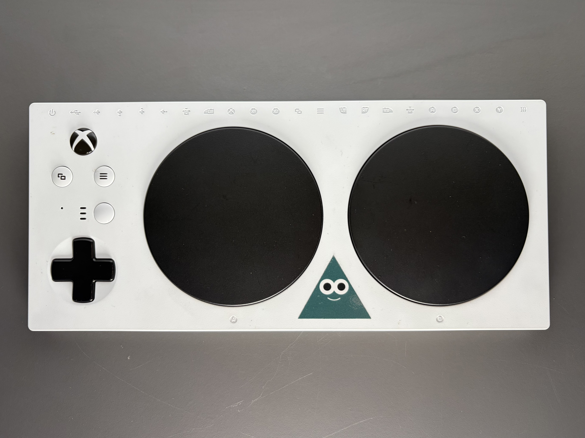
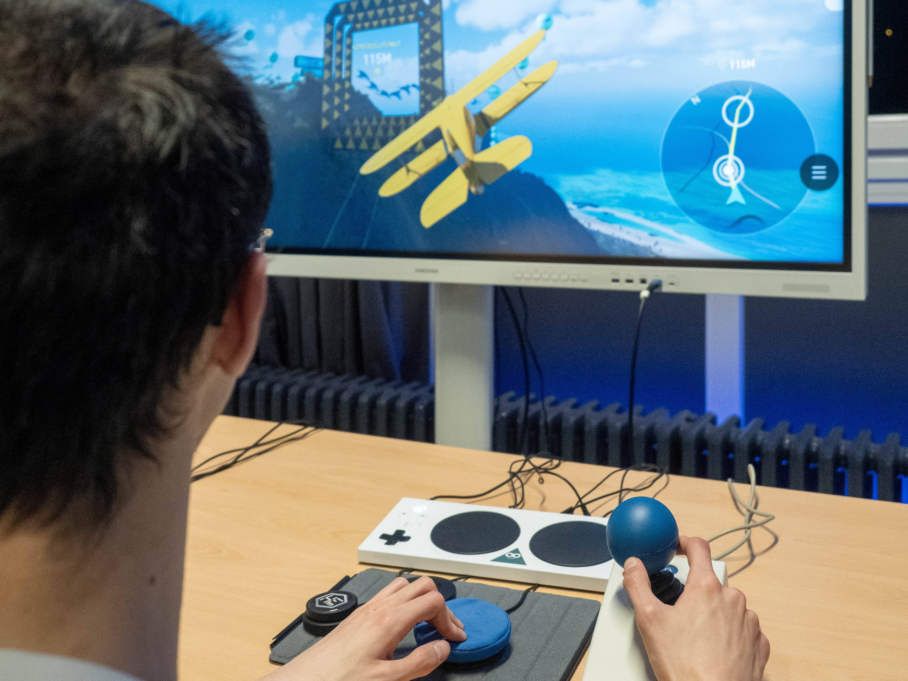

import LiveDemo from "../components/LiveDemo.astro";
import Icon from "astro-theme-university/components/Icon.astro";
import DeckExitLink from "../components/DeckExitLink.astro";
import { withBase } from "astro-theme-university/url";

<DeckExitLink href={withBase("/lectures/week-08/")} label="Week 8" />

<style>{`
  :root {
    --fs-week-accent: var(--at-tertiary);
    --fs-week-accent-ink: oklch(from var(--fs-week-accent) clamp(0.16, (0.58 - l) * 1000, 1) 0 h);
    --fs-week-accent-ink-alt: oklch(from var(--fs-week-accent) clamp(0.16, (l - 0.58) * 1000, 1) 0 h);
    --r-heading-color: var(--fs-week-accent);
    --r-link-color: var(--fs-week-accent);
    --at-accent: var(--fs-week-accent);
  }
`}</style>

{/* _class: hero */}

# The Ethics of Assistance

## Week 8 · Who Decides How Much a Mistake Costs

<p class="fs-badge">⚡ Live demo inside — you'll drive it yourself</p>



<p class="image-credit">Photo: InclusiveGameLab, CC BY-SA 4.0 — Xbox Adaptive Controller in use</p>

```notes
Don't state a position yet. This deck exists to make both sides genuinely
strong before the structured argument later in the session. Flag the live
demo up front so the room knows it's coming.
```

---

## Celeste ships a toggle



- widens timing windows
- slows the game down
- no penalty, no asterisk, on request, mid-run

<p class="image-credit">Photo: InclusiveGameLab, CC BY-SA 4.0</p>

```notes
Say the mechanism precisely — it's not "easy mode," it's specifically timing
windows widening and time slowing. That precision matters for the debate. The
photo isn't Celeste's own UI — it's a real adaptive controller, standing in
for the same idea: assistance as a deliberate, concrete piece of engineering,
not an abstract kindness.
```

---

{/* _class: impact */}

# Is that a different game?

<Icon name="gamepad" class="fs-watermark" />

```notes
Let this sit exactly as long as week 1's opening question did. It's doing the
same job.
```

---

## The strongest version of both sides

<div class="columns">
<div class="fs-panel">

<Icon name="thumbs-up" class="fs-panel-icon" />

### For

- a timing window is an arbitrary number, not a moral line
- players with different reflexes, motor control, or time deserve the same
  ending
- the *designed* challenge survives — only the tolerance around it changes

</div>
<div class="fs-panel">

<Icon name="thumbs-down" class="fs-panel-icon" />

### Against

- some difficulty **is** the content — the challenge and the game are the
  same object
- a widened window can quietly remove the exact tension the level was built
  around
- "no asterisk" can flatten a meaningful distinction some players want kept

</div>
</div>

```notes
Push the room to argue the side they don't hold. That's the actual skill this
week is teaching, not "pick a side."
```

---

## Assistance was never binary

| Game | What's offered | Who decides |
| --- | --- | --- |
| *Sekiro* | Nothing — one difficulty, by design | The designer, absolutely |
| *Hollow Knight* | No assist mode, but generous elsewhere | The designer, indirectly |
| *Celeste* | Full assist toggle, zero penalty | The player, mid-run |
| *God of War* | Graduated difficulty tiers | The player, up front |
| *Hades* | God Mode, woven into the story itself | The player, and the fiction |

<Icon name="switch-on" class="fs-watermark" />

```notes
Hades is the one to dwell on: it's the only row where the assistance option
is also a narrative device (Nyx explicitly grants you the boon). Ask whether
that changes the ethics of the other four rows.
```

---

{/* _class: centered */}
{/* _animate: assist */}

## A timing window, off

<div class="fs-assist-track">
<div class="fs-assist-window" data-id="assist-window" style="width: 18%" />
</div>

```notes
Static first, live next. Don't over-explain this one — just let the bar be
narrow.
```

---

{/* _class: centered */}
{/* _animate: assist */}

## The same window, widened

<div class="fs-assist-track">
<div class="fs-assist-window" data-id="assist-window" style="width: 55%" />
</div>

```notes
Same track, same marker speed, nothing else changed — only the window got
wider. That single moving edge is the entire mechanism the live demo is
about to hand them.
```

---

## Try it — same obstacle, your choice

<LiveDemo mode="assist" />

Play it straight first. Then turn assistance on and run it again — same
obstacle, same click. Notice what changed and what didn't.

```notes
The thing to listen for afterwards: did they say it felt like "more room" in
the same challenge, or "a different challenge"? That's the whole debate,
felt rather than argued.
```

---

## This is week 4 again, wearing a different name


A checkpoint policy is an assist decision — it decides how much of a mistake
gets forgiven. Assist Mode just makes the same decision explicit, and hands
it to the player instead of the designer.

<p class="image-credit">Photo: InclusiveGameLab, CC BY-SA 4.0</p>

```notes
This is the connective tissue of the course, said out loud: weeks 4 and 8 are
the same design question — who absorbs the cost of failure — asked about two
different levers.
```

---

## Today's structured argument

<div class="fs-flow">
<div class="fs-flow-step fs-panel">

<span class="fs-week-num">1</span>

you'll be assigned a side

</div>
<div class="fs-flow-step fs-panel">

<span class="fs-week-num">2</span>

defend the side you hold **less** strongly

</div>
<div class="fs-flow-step fs-panel">

<span class="fs-week-num">3</span>

the goal isn't to win — it's to make that side's best possible case

</div>
</div>

```notes
Set expectations before they break into groups: this only works if everyone
genuinely tries to make the other side's strongest argument, not a strawman.
```
