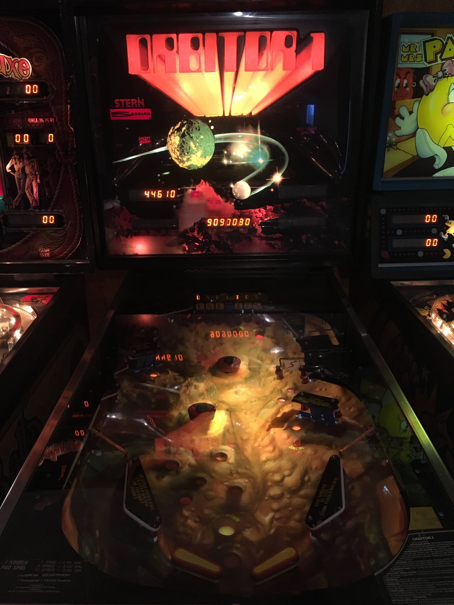

import LiveDemo from "../components/LiveDemo.astro";
import Icon from "astro-theme-university/components/Icon.astro";
import DeckExitLink from "../components/DeckExitLink.astro";
import { withBase } from "astro-theme-university/url";

<DeckExitLink href={withBase("/lectures/week-12/")} label="Week 12" />

<style>{`
  :root {
    --fs-week-accent: var(--fs-danger);
    --fs-week-accent-ink: oklch(from var(--fs-week-accent) clamp(0.16, (0.58 - l) * 1000, 1) 0 h);
    --fs-week-accent-ink-alt: oklch(from var(--fs-week-accent) clamp(0.16, (l - 0.58) * 1000, 1) 0 h);
    --r-heading-color: var(--fs-week-accent);
    --r-link-color: var(--fs-week-accent);
    --at-accent: var(--fs-week-accent);
  }
`}</style>

{/* _class: hero */}

# Feel

## Week 12 · Juice, Feedback, and the Moment of Loss

<p class="fs-badge">⚡ Live demo inside — you'll drive it yourself</p>



<p class="image-credit">Photo: Lino Wirag, CC BY-SA 4.0 — a pinball machine's playfield</p>

```notes
Last new idea of the semester before it turns into a capstone session. Keep
the pace brisk — the room wants to get to presentations. Flag the live demo
up front so the room knows it's coming.
```

---

## Nothing requires the shake


A block breaking needs no screen shake to stop existing.

The logic is identical with or without one — same collision, same removal,
same score update.

<p class="image-credit">Photo: Lino Wirag, CC BY-SA 4.0</p>

```notes
Say this plainly, almost boringly. The point is that the *logic* truly
doesn't need it — which is exactly what makes the next slide land.
```

---

{/* _class: quote */}

## Juice changes nothing about what happened

— and everything about whether it registered.

<Icon name="sine-wave" class="fs-watermark" />

```notes
This is the line the whole deck, and arguably the whole course, has been
building toward.
```

---

{/* _class: centered */}
{/* _animate: juice */}

## Same event. No feedback.

<div class="fs-juice-meter">
<div class="fs-juice-fill" data-id="juice-fill" style="width: 8%" />
</div>

```notes
The block breaks. The bar barely twitches. Mechanically complete, perceptually
silent — that's "juice off" in one image.
```

---

{/* _animate: juice */}

## Same event. Full feedback.

<div class="fs-juice-meter">
<div class="fs-juice-fill" data-id="juice-fill" style="width: 92%" />
</div>

```notes
Identical event, identical logic underneath — only how loudly it announces
itself changed. That's the gap the live demo is about to hand them directly.
```

---

## Try it — identical outcome, two feelings

<LiveDemo mode="juice" />

Both blocks break on the same click, with the identical outcome. Watch how
differently the two announce it.

```notes
Ask directly: which one did it feel like you actually *did*? That gap is the
entire content of this week.
```

---

## Twelve weeks, one argument

<ol class="fs-arc-timeline fs-arc-timeline--cleared">
<li class="fs-arc fs-arc--foundations">
<p class="fs-arc-label">Foundations</p>
<ol class="fs-arc-weeks">
<li class="fs-week"><span class="fs-week-num">1</span><span class="fs-week-title">Why Failure Feels Bad</span></li>
<li class="fs-week"><span class="fs-week-num">2</span><span class="fs-week-title">The Taxonomy of Losing</span></li>
<li class="fs-week"><span class="fs-week-num">3</span><span class="fs-week-title">Lives, Continues, Arcade Economy</span></li>
</ol>
</li>
<li class="fs-arc fs-arc--design">
<p class="fs-arc-label">Design decisions</p>
<ol class="fs-arc-weeks">
<li class="fs-week"><span class="fs-week-num">4</span><span class="fs-week-title">Checkpoints — Architecture of Mercy</span></li>
<li class="fs-week"><span class="fs-week-num">5</span><span class="fs-week-title">Permadeath &amp; Consequence</span></li>
<li class="fs-week"><span class="fs-week-num">6</span><span class="fs-week-title">Death as Narrative Engine</span></li>
<li class="fs-week"><span class="fs-week-num">7</span><span class="fs-week-title">Difficulty as Communication</span></li>
</ol>
</li>
<li class="fs-arc fs-arc--people">
<p class="fs-arc-label">People &amp; culture</p>
<ol class="fs-arc-weeks">
<li class="fs-week"><span class="fs-week-num">8</span><span class="fs-week-title">The Ethics of Assistance</span></li>
<li class="fs-week"><span class="fs-week-num">9</span><span class="fs-week-title">Speedrunning &amp; the Death That Isn't</span></li>
<li class="fs-week"><span class="fs-week-num">10</span><span class="fs-week-title">Losing Together</span></li>
<li class="fs-week"><span class="fs-week-num">11</span><span class="fs-week-title">Comedy, Rage &amp; Aesthetics</span></li>
</ol>
</li>
<li class="fs-arc fs-arc--craft">
<p class="fs-arc-label">Craft</p>
<ol class="fs-arc-weeks">
<li class="fs-week"><span class="fs-week-num">12</span><span class="fs-week-title">Feel — Juice &amp; Feedback</span></li>
</ol>
</li>
</ol>

Failure is designed, at every layer, on purpose.

```notes
Same map as week 1, every node now filled in. Point at it directly — "we
started here, twelve weeks ago" — before moving to the brief.
```

---

## The final project

> Design an original fail state — real, prototyped, or specified on paper —
> and be ready to explain the failure it's designed to produce.

- worth 40% of the course, due next Monday
- judged as a whole: one well-considered fail state beats an ambitious system
  nobody had time to design
- a playable prototype, **or** a fully specified paper design — both count
- 500–800 word justification, plus a live 3-minute presentation

```notes
Emphasize "scope honestly" out loud — remind them the marking guide rewards
depth on one decision over breadth across many.
```

---

{/* _class: qr-panel */}

## Get the brief on your phone


### The final project brief

Scan now — worth thirty seconds while it's on screen, before it's just a link
to hunt for later.

```notes
Give this thirty seconds before moving on — worth people actually scanning it
now rather than hunting for the link later.
```

---

{/* _class: impact */}

# Final projects, today

Three minutes each. Make the fail state legible on sight.

<Icon name="trophy" class="fs-watermark" />

```notes
Hand off to the session structure here — this is the last slide before
presentations start.
```
